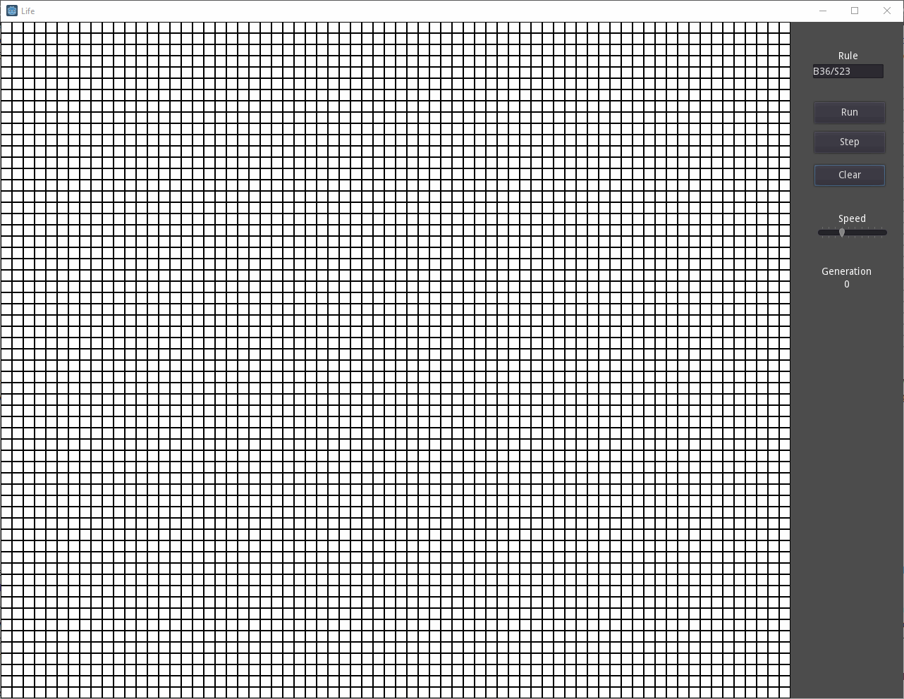

# GodotLife
#### Conway's game of life implementation using the Godot Engine.

This was a fun project I worked on when learning the Godot Engine. It's basically an implementation of [Conway's Game Of Life](https://en.wikipedia.org/wiki/Conway%27s_Game_of_Life),
a popular version of [cellular automation](https://en.wikipedia.org/wiki/Cellular_automaton).

The idea is fairly straightforward: Given an array of cells (2d used here), each cell lives or dies by a set of simple rules that
determine whether the cell dies due to over-population, under-population or survives to the next generation (one pass over the 
algorithm). A new cell can be born too depending on the same rules. This is determined by looking at the 8 neighbours for each cell.

The rules are encoded in the form of Bxyz/Sabc, which indicate under which conditions a cell can be born (if it has x, y or 
z number of neighbours) or Survive (a, b or c number of neighbours). A cell which fails to meet either conditions dies (if it's 
living). 

The standard rule is B3/S23 which says a cell is born if it has 3 living neighbours and Survives if it has 2 or 3 neighbours. 
Another popular variation is B36/S23

Here it is in action:
 
